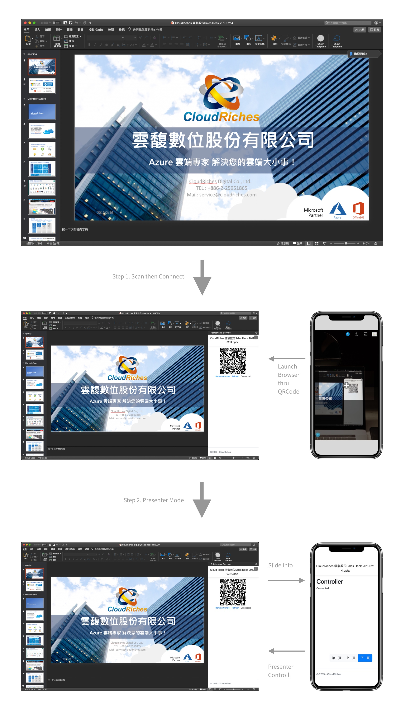
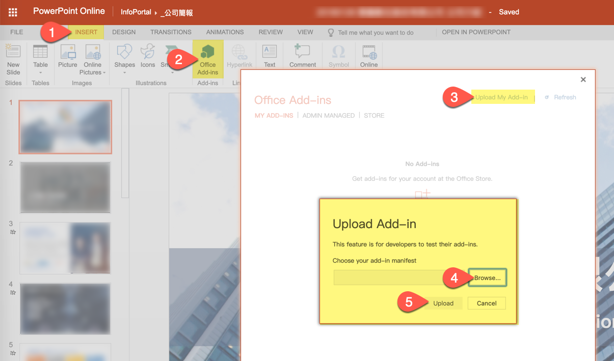

# Pointer as a Service

## Purpose

Provide the easiest way of making a smartphone can control your presentation. Working on all devices, working without apps installing, working without pairing, it only needs internet.

## How it works



## Install Office Add-ins

### PowerPoint for Windows

https://docs.microsoft.com/en-us/office/dev/add-ins/testing/create-a-network-shared-folder-catalog-for-task-pane-and-content-add-ins

### PowerPoint for macOS

https://docs.microsoft.com/en-us/office/dev/add-ins/testing/sideload-an-office-add-in-on-ipad-and-mac 

```bash
curl https://raw.githubusercontent.com/dinowang/pointer-as-a-service/049a77a088be44ff97909c24c22f2fc7c4d16381/manifest/pointer-as-a-service.xml -o ~/Library/Containers/com.microsoft.Powerpoint/Data/Documents/wef/pointer-as-a-service.xml
```

### PowerPoint Online

First, download Office Add-ins manifest from [here](https://raw.githubusercontent.com/dinowang/pointer-as-a-service/master/manifest/pointer-as-a-service.xml) and save to your local disk.




## Used technology

- Azure
- ASP.NET Core
- ASP.NET Core SignalR
- Office 365 PowerPoint

[Build Instruction](source/README.md)

## License

Copyright (c) 2019 CloudRiches [https://www.cloudriches.com/](https://www.cloudriches.com/)

The project is licensed under the MIT license.