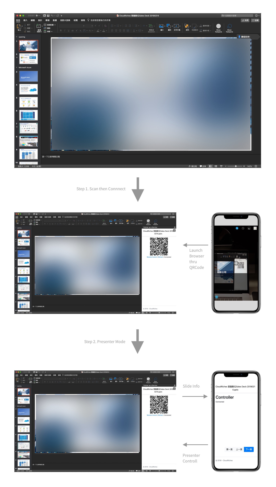

# Pointer as a Service

## Purpose

Provide easiest way make smart phone can control your presentation. Without specify device or apps. Without pairing. Just need internet.

## How it works

## Used technology

- Azure
- ASP.NET Core
- ASP.NET Core SignalR
- Office 365 PowerPoint 

